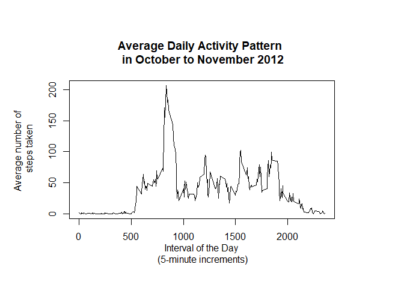
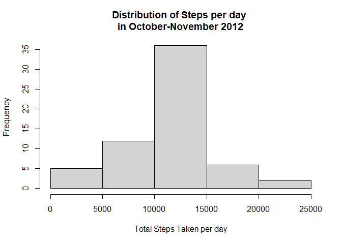
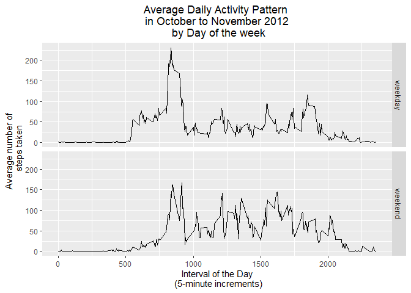

## Loading and preprocessing the data
1.Load the data

```r
dat<- read.table(unz("activity.zip", "activity.csv"), header=T, quote="\"", sep=",")
```
2.Process the data into format suitable for analysis.

```r
dat$date<-as.Date(dat$date)
summary(dat)
```

```
##      steps             date               interval     
##  Min.   :  0.00   Min.   :2012-10-01   Min.   :   0.0  
##  1st Qu.:  0.00   1st Qu.:2012-10-16   1st Qu.: 588.8  
##  Median :  0.00   Median :2012-10-31   Median :1177.5  
##  Mean   : 37.38   Mean   :2012-10-31   Mean   :1177.5  
##  3rd Qu.: 12.00   3rd Qu.:2012-11-15   3rd Qu.:1766.2  
##  Max.   :806.00   Max.   :2012-11-30   Max.   :2355.0  
##  NA's   :2304
```
## What is mean total number of steps taken per day?
1. Histogram of the total number of steps taken each day. 

```r
library(dplyr)
steps_per_day<-dat%>%
  group_by(date)%>%
  summarize(steps=sum(steps,na.rm=TRUE))
```


```r
hist(steps_per_day$steps,main="Distribution of Steps per day \n in October-November 2012 ",xlab="Total Steps Taken per day")
```

<!-- -->


2. Calculate and report the mean and median total number of steps taken per day. 

```r
mean_steps<-round(mean(steps_per_day$steps),0)
median_steps<-median(steps_per_day$steps)
```
The mean steps per day is 9354. The median steps per day is 10395.

## What is the average daily activity pattern?
1. Make a time series plot (i.e. type="l") of the 5-minute interval(x-axis) and the average number of steps taken, averaged across all days (y-axis). 

```r
steps_by_interval<-dat%>%
  group_by(interval)%>%
  summarize(steps=mean(steps,na.rm=TRUE))

par(mar=c(5,5,5,5),oma=c(1,1,2,1))
with(steps_by_interval,plot(x=interval, y=steps, type="l",main="Average Daily Activity Pattern \n in October to November 2012", xlab="Interval of the Day\n (5-minute increments)",ylab="Average number of \n steps taken"))
```

<!-- -->

2.Which 5-minute interval, on average across all the days in the dataset, contains the maximum number of steps? 

```r
int_max_steps<-steps_by_interval[steps_by_interval$steps==max(steps_by_interval$steps),]
```
The 835^th^ interval contains the maximum number of steps of 206.

## Imputing missing values
1. Calculate and report the total number of missing values in the dataset. 

```r
dat_na<-sum(is.na(dat))
```
The number of rows with missing values is 2304.

2. The strategy for filling in all of the missing values in the datase is to input the mean for the 5 minute interval. 

```r
steps_by_interval$steps<-round(steps_by_interval$steps,0)
```
3. Create a new dataset that is equal to the original dataset but with the missing data filled in. 

```r
dat_subset1<-dat[is.na(dat),]
dat_subset2<-na.omit(dat)
dat_subset3<-merge(dat_subset1,steps_by_interval,by="interval",all.x=TRUE)
dat_subset3<-dat_subset3[,-2]
names(dat_subset3)[3]<-"steps"
dat_new<-rbind(dat_subset3,dat_subset2)
```
4. Make a histogram of the total number of steps taken each day. 

```r
steps_per_day_new<-dat_new%>%
  group_by(date)%>%
  summarize(steps=sum(steps))

hist(steps_per_day_new$steps,main="Distribution of Steps per day \n in October-November 2012 ",xlab="Total Steps Taken per day")
```

<!-- -->

Calculate and report the mean and median total number of steps taken per day. 

```r
mean_steps_new<-as.integer(mean(steps_per_day_new$steps),0)
median_steps_new<-as.integer(median(steps_per_day_new$steps))
```
After imputing the missing step values, the mean steps per day is 10765 and the median steps per day is 10762, Imputing the missing values has increased the estimates of the total number of steps. 

## Are there differences in activity patterns between weekdays and weekends?
1. Create a new factor variable in the dataset with two levels indicating whether a given date is a weekday or weekend day. 

```r
dat_new$weekday<-weekdays(dat_new$date)
dat_new<-mutate(dat_new, day = ifelse(weekday %in% 
                               c("Sunday","Saturday"),
                             "weekend","weekday"))
dat_new$day<-as.factor(dat_new$day)
```
2. Make a panel plot containing a time series plot (i.e. type = "l") of the 5-minute interval (x-axis) and the average number of steps taken, averaged across all weekday days or weekend days (y-axis). 

```r
steps_by_day<-dat_new%>%
  group_by(day,interval)%>%
  summarize(steps=mean(steps,na.rm=TRUE))

library(ggplot2)

g<-ggplot(steps_by_day,aes(interval,steps))
g+geom_line()+facet_grid(day ~ .)+
  xlab("Interval of the Day\n (5-minute increments)") + 
  ylab("Average number of \n steps taken") +
  ggtitle("Average Daily Activity Pattern \n in October to November 2012 \n by Day of the week")+
  theme(plot.title = element_text(hjust = 0.5))
```

<!-- -->

